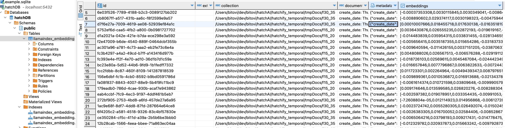

# Temporal AI workflow

The following is a simplified sample Temporal workflow to create custom embeddings from large list of files.


## Installing and running dependencies

This repo contains a simple local development setup. For production use, we would recommend using Temporal Cloud and AWS.

Use the following command to run everything you need locally:
- Localstack (for storing files in local S3)
- Postgres (where embeddings are stored)
- Temporal (runs `temporal server start-dev` in a docker container)
- A Temporal Worker (to run your workflow/activity code)

```bash
docker compose up --build -d
```

## Tearing everything down

RUn the following command to turn everything off:

```bash
docker compose down -v
```

## NOTES 

stored indexes and embeddings in DB , refer to a certain location of collections, when the chat engine need to be used, it should have access to those locations, to be able to read and "embedd" the relevant parts in the request to the LLM

